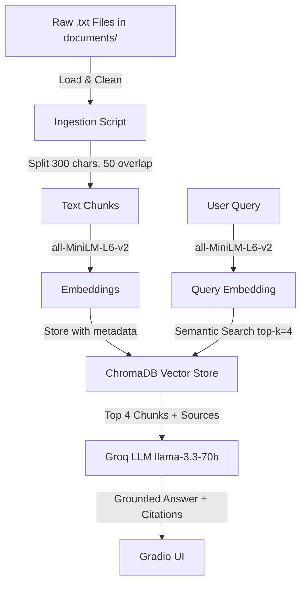

# Project 1 Planning: The Unofficial Guide

> Write this document before you write any pipeline code.
> Your spec and architecture diagram are what you'll use to direct AI tools (Claude, Copilot, etc.) to generate your implementation — the more specific they are, the more useful the generated code will be.
> Update the Retrieval Approach and Chunking Strategy sections if you change your approach during implementation.
> Update this file before starting any stretch features.

---

## Domain

## Domain
My domain is student reviews of Computer Science professors at the University of Central Oklahoma (UCO). This knowledge is valuable because it captures honest, experience-based opinions about teaching style, grading, exam difficulty, and workload that students actually use to make course decisions. This information is hard to find through official channels because UCO's website only lists professor names and credentials, it never tells you whether a professor's exams are brutal, whether they respond to emails, or whether their lectures are worth attending.
---

## Documents

<!-- List your specific sources: URLs, subreddit names, forum threads, or file descriptions.
     Aim for at least 10 sources that together cover different subtopics or perspectives within your domain. -->

| # | Source | Description | URL or location |
|---|--------|-------------|-----------------|
| 1 | Rate My Professors | Student reviews of Hong Sung | https://www.ratemyprofessors.com/professor/359060 |
| 2 | Rate My Professors | Student reviews of Sila Tamang | https://www.ratemyprofessors.com/professor/3010705 |
| 3 | Rate My Professors | Student reviews of Goutam Mylavarapu | https://www.ratemyprofessors.com/professor/2876034 |
| 4 | Rate My Professors | Student reviews of Mike Bockus | https://www.ratemyprofessors.com/professor/1767407 |
| 5 | Rate My Professors | Student reviews of Michael Bihn | https://www.ratemyprofessors.com/professor/3038230 |
| 6 | Rate My Professors | Student reviews of Bjorn Larson | https://www.ratemyprofessors.com/professor/2955505 |
| 7 | Rate My Professors | Student reviews of Gang Qian | https://www.ratemyprofessors.com/professor/600661 |
| 8 | Rate My Professors | Student reviews of Jicheng Fu | https://www.ratemyprofessors.com/professor/1314642 |
| 9 | Rate My Professors | Student reviews of Myung-Ah Park | https://www.ratemyprofessors.com/professor/1182070 |
| 10 | Rate My Professors | Student reviews of John Rhee | https://www.ratemyprofessors.com/professor/2624544 |

---

## Chunking Strategy

**Chunk size:** 300 characters

**Overlap:** 50 characters

**Reasoning:** My documents are short student reviews, typically 2-4 sentences each. A 300 character chunk is large enough to capture one complete thought or opinion from a review without merging multiple unrelated opinions together. The 50 character overlap ensures that if a key opinion spans a chunk boundary — for example a student describing both exam difficulty and grading in the same sentence — both chunks will contain enough context to be retrievable. Chunks smaller than 300 characters risk cutting individual sentences in half, while larger chunks would merge different students' opinions and dilute the semantic signal for retrieval.

---

## Retrieval Approach

**Embedding model:** all-MiniLM-L6-v2 via sentence-transformers

**Top-k:** 4

**Production tradeoff reflection:** For this project I am using all-MiniLM-L6-v2 because it runs locally with no API key or rate limits and is fast enough for a small corpus. In a production system I would consider tradeoffs like: context length (all-MiniLM-L6-v2 is limited to 256 tokens which is fine for short reviews but would fail on longer documents), multilingual support (if students wrote reviews in other languages I would need a multilingual model like paraphrase-multilingual-MiniLM-L12-v2), accuracy on domain-specific text (a model fine-tuned on academic or review text might retrieve more precisely), and latency vs cost (OpenAI's text-embedding-3-small is more accurate but costs money and requires an API call for every query).

---

## Evaluation Plan

| # | Question | Expected answer |
|---|----------|-----------------|
| 1 | What do students say about Dr. Mylavarapu's exams? | Students say exams can tank your grade if you don't follow lectures and take notes, but they are doable if you pay attention in class. |
| 2 | Does Hong Sung give tests in his classes? | No, Hong Sung's classes have no tests or quizzes. Grades are based entirely on projects and assignments. |
| 3 | How is Michael Bihn's teaching style described by students? | Students say he reads off slides in a monotone voice, often doesn't know the material himself, and expects students to teach themselves from the textbook or YouTube. |
| 4 | What do students say about Myung-Ah Park's difficulty level? | Students consistently describe her classes as unnecessarily difficult with very hard tests weighted heavily, and recommend taking Dr. Mylavarapu instead for Data Structures. |
| 5 | Is Gang Qian responsive to student questions outside of class? | Yes, students say Dr. Qian responds quickly to questions, is always available, and is extremely helpful inside and outside of class. |

---

## Anticipated Challenges

1. **Chunk boundary splitting:** Since reviews are short and opinionated, a 300 character chunk might cut a review mid-sentence, separating the opinion from its context. For example "His exams are brutal —" might land in one chunk while "— but fair if you study his lectures" lands in the next. The 50 character overlap helps but may not fully solve this.

2. **Attribution accuracy:** Multiple professors have similar complaints (monotone lectures, hard tests, unresponsive to emails). The retrieval system might pull chunks about the wrong professor if the professor's name doesn't appear in that specific chunk. This could cause the LLM to attribute one professor's behavior to another.

---

## Architecture

---

## AI Tool Plan

**Milestone 3 — Ingestion and chunking:**
I will give Claude my Domain section, Documents section, and Chunking Strategy section and ask it to implement a script that loads all 10 .txt files from the documents/ folder, cleans them, and splits them into 300 character chunks with 50 character overlap. I will verify the output by printing 5 sample chunks and checking they are readable and self-contained.

**Milestone 4 — Embedding and retrieval:**
I will give Claude my Retrieval Approach section and Architecture diagram and ask it to implement an embedding script that uses all-MiniLM-L6-v2 to embed all chunks and store them in ChromaDB with source metadata, plus a retrieve() function that takes a query string and returns the top 4 most relevant chunks. I will verify by running 3 test queries and checking that returned chunks are actually relevant.

**Milestone 5 — Generation and interface:**
I will give Claude my full planning.md and ask it to implement a generation function that passes retrieved chunks to Groq's llama-3.3-70b-versatile with a grounding prompt that forces answers from retrieved context only, plus a Gradio UI with a question input and answer/sources output. I will verify by testing a question my documents don't cover and confirming the system refuses to answer rather than hallucinating.

**Milestone 3 — Ingestion and chunking:**

**Milestone 4 — Embedding and retrieval:**

**Milestone 5 — Generation and interface:**
